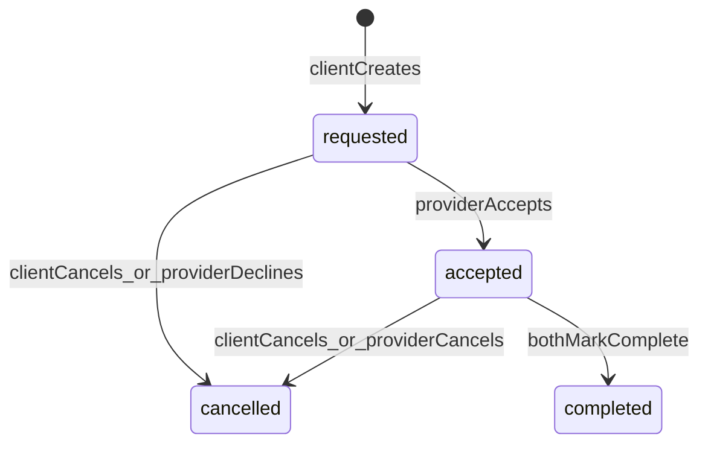

# 訪問型サービスアプリ（Web）MVP 仕様（確定版）

## 1. ロールと権限

- **依頼者(Client)**: 提供者の検索・予約作成・チャット・レビュー投稿
- **提供者(Provider)**: プロフィール/提供サービス編集・予約承認/辞退・チャット・完了確認・レビュー閲覧
- **管理者(Admin)**: 通報対応、ユーザー停止、レビュー非表示、手数料台帳の入金確認

備考:
- **同一アカウントで依頼者/提供者を兼務可能**（MVPでは「提供者プロフィールを作成したらProvider機能が解放」）
- **メール認証ログイン**のみ（パスワードなし）

## 2. 画面一覧（MVP）

### 2.1 共通
- `/` トップ（カテゴリ導線、検索）
- `/auth` ログイン（メール入力→コード送信）
- `/auth/verify` 認証コード入力→ログイン完了
- `/terms` 利用規約（簡易）
- `/privacy` プライバシーポリシー（簡易）

### 2.2 依頼者
- `/providers` 提供者一覧（カテゴリ/エリア/価格/評価で絞り込み）
- `/providers/[providerId]` 提供者詳細（プロフィール、提供サービス、レビュー）
- `/bookings` 予約一覧（自分の依頼）
- `/bookings/[bookingId]` 予約詳細（状態、操作、チャット、完了、レビュー）

### 2.3 提供者
- `/me/provider` 提供者プロフィール編集（サービス、料金、対応エリア、紹介文）
- `/bookings` 予約一覧（自分が受ける予約）
- `/bookings/[bookingId]` 予約詳細（承認/辞退、チャット、完了確認）

### 2.4 管理者
- `/admin` 管理ダッシュボード
- `/admin/users` ユーザー一覧/停止
- `/admin/reviews` レビュー一覧/非表示
- `/admin/ledgers` 手数料台帳（未払い/支払済みの更新）
- `/admin/reports` 通報一覧/対応ステータス更新

## 3. 状態遷移（Booking）

### 3.1 Bookingステータス
- `requested`: 依頼者が予約リクエスト送信
- `accepted`: 提供者が承認（成立）
- `cancelled`: 依頼者または提供者がキャンセル
- `completed`: 双方が完了確認し、案件が完了

### 3.2 遷移ルール（権限）

- **requested → accepted**: 提供者のみ
- **requested → cancelled**: 依頼者のキャンセル、または提供者の辞退（=キャンセル扱い）
- **accepted → cancelled**: 双方可能（理由メモは残す）
- **accepted → completed**:
  - 依頼者が「完了申請」→ `clientMarkedCompleteAt` 記録
  - 提供者が「完了承認」→ `providerMarkedCompleteAt` 記録
  - 両方が揃ったら `completed` に遷移し `completedAt` を記録

## 4. チャット（Booking単位の1対1）

- **スレッド単位**: `bookingId` に紐づく `ChatThread` を1つ作成
- **参加者**: 依頼者と提供者の2名のみ
- **送信**: `ChatMessage`（テキストのみ）
- **既読**:
  - スレッド参加者ごとに `lastReadAt` を保持し、未読数を算出
- **モデレーション**:
  - MVPでは管理者が通報されたメッセージを閲覧できる（全件監視はしない）

## 5. レビュー/評価（最低限の不正対策）

- **投稿できる条件**: `completed` のBookingに対してのみ
- **重複禁止**: 1つのBookingにつき1件（MVPでは「依頼者→提供者」レビューのみ）
- **公開**:
  - Provider詳細に平均★とレビュー一覧を表示
- **不正対策（最低限）**:
  - 管理者が `isHidden` で非表示にできる（理由も残す）

## 6. 手数料（成果報酬）10%（決済はアプリ外）

- **前提**: アプリ内で自動徴収しない（現金/振込など）
- **台帳生成タイミング**: Bookingが `completed` になった瞬間に `CommissionLedger` を自動生成
- **手数料計算**:
  - `amountYen`（案件金額: MVPでは完了時に入力/確定）
  - `commissionRate = 0.10`
  - `commissionYen = round(amountYen * 0.10)`（端数は四捨五入）
- **入金確認**: 管理者が `paid` に更新し `paidAt` を記録

## 7. 通報と停止（最小）

- **通報対象**: ユーザー/予約/メッセージ/レビュー
- **管理者**:
  - 通報ステータス（open/in_progress/closed）更新
  - ユーザー停止（停止中はログイン後の操作をブロック）

